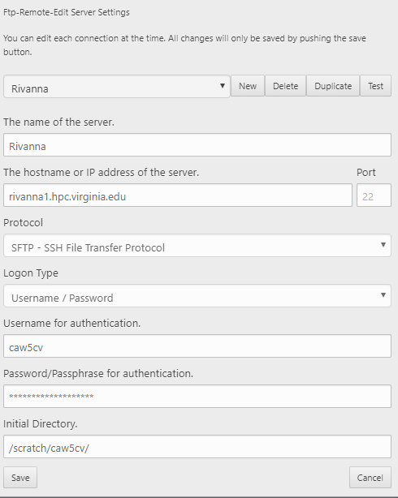
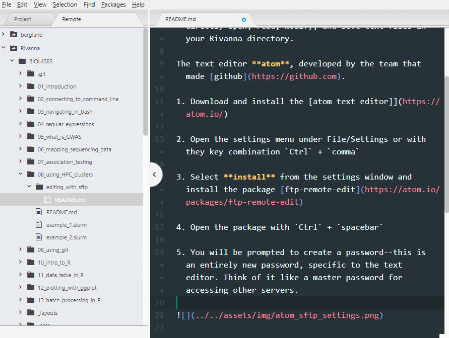

# Batch Processing & HPC Clusters

## Overview

Last week, you performed association tests using `plink`,  a `.vcf` file containing genotypes for 500 individuals, and the phenotypes for the 500 individuals. While this may *seem* like a lot of data, it only included the very small mitochondrial genome, which is ~17000 base pairs. The entire human genome is approximately two billion base pairs--over 100,000 times larger!

These kind of calculations will take more processing power than we've been using so far. If we tried to run a GWAS using a single processing core, it would take far too long. Luckily, *Rivanna* is a **High-Performance Computing** system made up of hundreds of processing cores that can be accessed by users. Today, we'll learn how to access these powerful computing resources.

Specifically, you will learn:
  * How to quickly view and modify text files using SFTP within a text editor. [*link*](#viewing-and-editing-files-with-sftp)
  * Why it's necessary to submit jobs, instead of just running things interactively
  * How *core-hours* represent the 'currency' of HPC systems
  * How to submit and monitor HPC jobs using the *SLURM* job manager
  * How to submit dozens to hundreds of related tasks using *Job Arrays*


## Viewing and editing files with SFTP

Until now, you've viewed files using `cat` or `less` and edited files with `vim` or `nano`. While these commands are useful, sometimes all we want is to edit documents in a text editor. Now that you've learned how to do things the *hard* way, we'll be learning a much simpler method, called **SFTP**. SFTP stands for SSH File Transfer Protocol, and that's exactly what it does: transfers files over SSH. This will let you use a file browser within a text editor, so you can directly open, read, modify, and save text files in your Rivanna directory.

The text editor **atom**, developed by the team that made [github](https://github.com).

1. Download and install the [atom text editor](https://atom.io/)

2. Open the settings menu under File/Settings or with they key combination `Ctrl` + `comma`

3. Select **install** from the settings window and install the package [ftp-remote-edit](https://atom.io/packages/ftp-remote-edit)

4. Open the package with `Ctrl` + `spacebar`

5. You will be prompted to create a password--this is an entirely new password, specific to the text editor. Think of it like a master password for accessing other servers.

6. To access files on Rivanna, you need to enter information for connecting to it. Yours should look similar to the settings below, but with your own computing ID and your own Rivanna password.



7. You should now see your `/scratch/<computingID>/` folders within the file browser. You can open them to view or edit the contents. Upon saving, it will be uploaded to Rivanna. You can collapse and expand a directory to refresh its contents.

  

## Why do I need to 'submit' jobs anyway?

Many people use Rivanna at a single time. When running a program, it is typically necessary to reserve memory and processor cores. This is so the program doesn't try to access resources that are currently in use or busy. when you log in, you have limited access to a set amount of memory and processor cores. You must submit a job to the *SLURM* job manager to access more resources. FYI, *SLURM* stands for

  * Simple
  * Linux
  * Utility for
  * Resource
  * Management

## What are core-hours and service units?

Access to computing resources can be thought of as a service, and that costs resources. In order to make sure that access to Rivanna is shared across all users, instead of being hogged by few, access is 'bought' with a 'currency' called **service units** measured in core-hours: if you run a job on a single core for one hour, that job 'costs' one core-hour.

Typically, a research group will have an *allocation* of service units that everyone in the lab draws from. The allocation is like a shared banking account for service units. For this class, we all share an *allocation* that was granted to us for course use.

## Jobs are submitted to *Queues*

*SLURM* takes user-provided information to best allocate computing resources. Jobs that request little memory and little time typically have a high priority. Jobs that request a significant amount of resources may need to 'wait in line' if resources are busy. All of these decisions of where and when jobs eventually run is handled behind the scenes. When you submit a job, you specify which queue it is ran in with  `--partition` and one of the following options: `standard`, `parallel`, `largemem` or `dev`.

  * the **standard** queue is the most common option, for typical use.  
  * the **parallel** queue is for jobs that require special architecture for parallel computing.
  * the **largemem** queue is for jobs that need exceptionally large quantities of memory.
  * the **dev** is for developing and testing scripts on a small scale. This queue doesn't cost any core-hours when running, and is intended to be used to make sure code works, not for heavy use. After testing code in the **dev** queue, your tasks can be ran at the full scale on the other queues.

## *SLURM* requests are formatted in `bash` scripts
The resource requests are usually included in the header of a `bash` script. View `example_1.slurm` and `example_2.slurm` to see how they are typically formatted. The parameters in these example files are:

  * `--ntasks` followed by an integer, the number of cores requested
  * `--mem` followed by the memory requested, e.g. `8G` for 8 gigabytes, `120M` for 120 megabytes
  * `--time` followed by the time limit formatted as `D-HH:MM:SS`, e.g. `0-12:00:00` for 12 hours.
  * `--partition` followed by the queue, e.g. `standard` or `dev`
  * `--account` followed by the allocation of service units to draw from

*Note*: the top line, formatted like `#!/usr/bin/env bash` is called a *shebang* line. It is used to identify what kind of language the file is written in, and ensures the file is executed using the right program. In this case, it's written in `bash` and would be executed as such.

## Submitting and monitoring *SlURM* jobs

To **submit** a new job, use the `sbatch` command followed by the name of the slurm script to be submitted.

to **view your recent job history**, use the `sacct` command. Jobs can either be **PENDING** while waiting for resources to be available and **RUNNING** while being executed. Jobs that you interrupt will be labeled **CANCELLED** and jobs that exit with errors will be labeled **FAILED**. Those that exit without errors are labeled **COMPLETED**.

To **cancel** a currently-running job, you can run `scancel JOBID`. `JOBID` is the number associated with a specific job, and you can view these IDs when you print your job history using `sacct`. You may wish to cancel a job if you realize there are mistakes in the code you submitted.

Submit the example script located in your folder. The job should take one minute to run.

```bash
sbatch ./example_1.slurm
```

Check the progress of the job using `sacct`, to see the progress change from pending to running to completed.

Any messages or errors that are printed during your job will be printed to a file named `slurm-JOBID.out`. View the contents of the file to see what was printed after the job completed.

Next, submit the same job again.
```bash
sbatch ./example_1.slurm
```

But this time, cancel the job using `scancel` after it starts. Check your job history with `sacct` to see that the job status changed to **CANCELLED**. Then view the output of `slurm-JOBID.out` for this most recently ran job, compared to the first one.

## Writing a *SLURM* script to perform GWAS


## In-class questions (also on collab):
1. How many core-hours would it cost to run a single 24-core job for 15 minutes?
2. How many core-hours would it cost to run a job array of 120 jobs, each expected to run for 3 hours, with 4 cores a piece?
3. Run the command `allocations`. Which allocation(s) you have permissions to use when submitting jobs, and how many service-hours does it have?
4. You view the contents a file and notice the first line is `#!/usr/bin/env python`. What does this tell you about the file? What does this tell the *shell* about the file?

## Homework

1. You are planning on submitting a job that processes an extremely large data file. Based on testing on the `dev` queue with a subset of the data, you anticipate the full data set will require 50GB of memory, and to take at most 12 hours. The program you are running does not have any way of using multiple processing. What might your `SLURM` header look like?

2. How many core-hours will `example_1.slurm` deduct if it takes the full requested amount of time? Explain.
2. How many core-hours will `example_2.slurm` deduct if it takes the full requested amount of time? Explain.
    # zero, because it's on the `dev` queue.


3. Investigate
